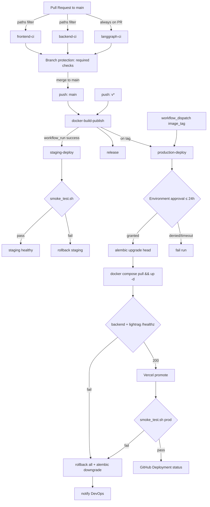
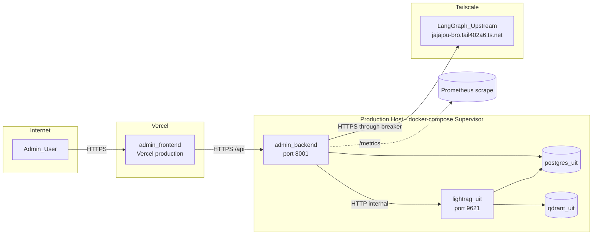
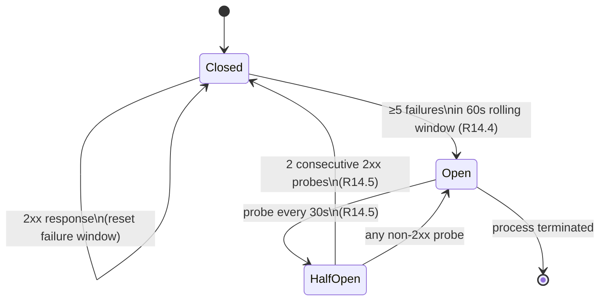
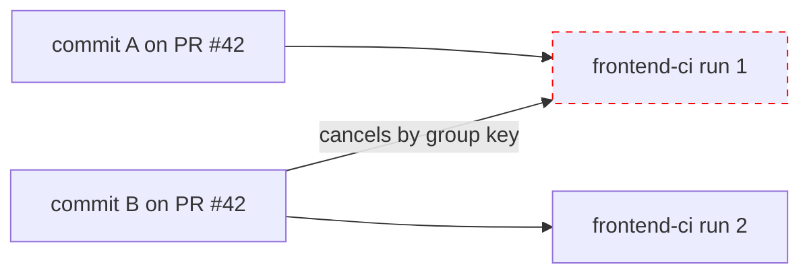
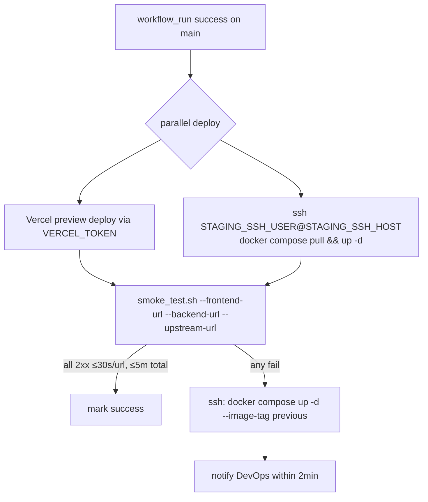
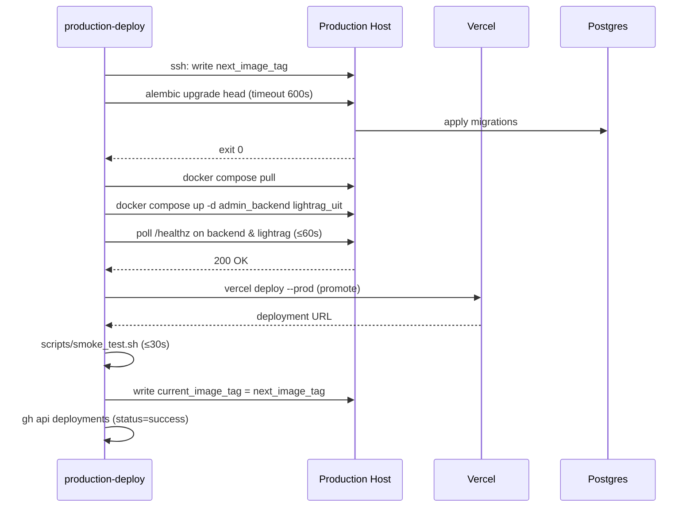
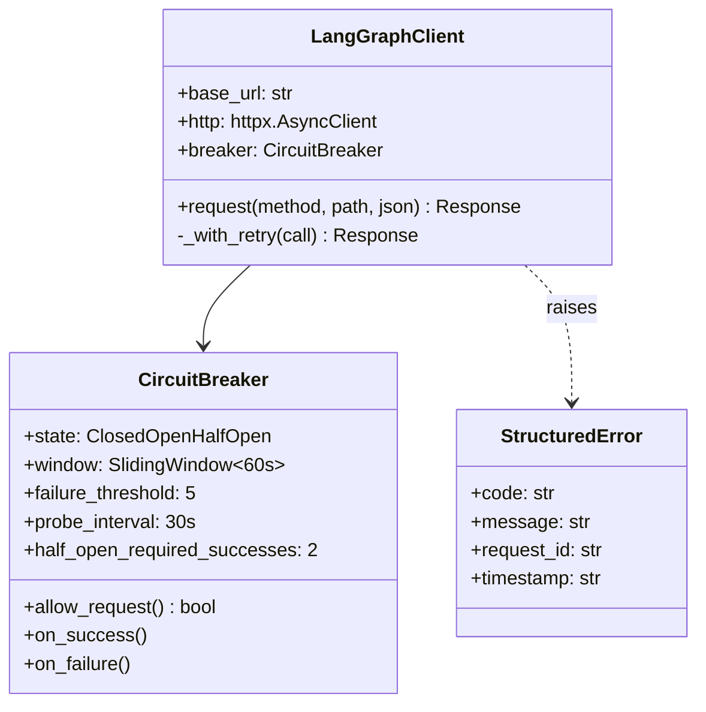
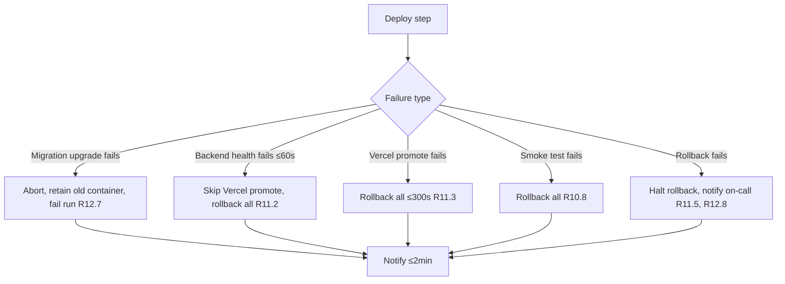
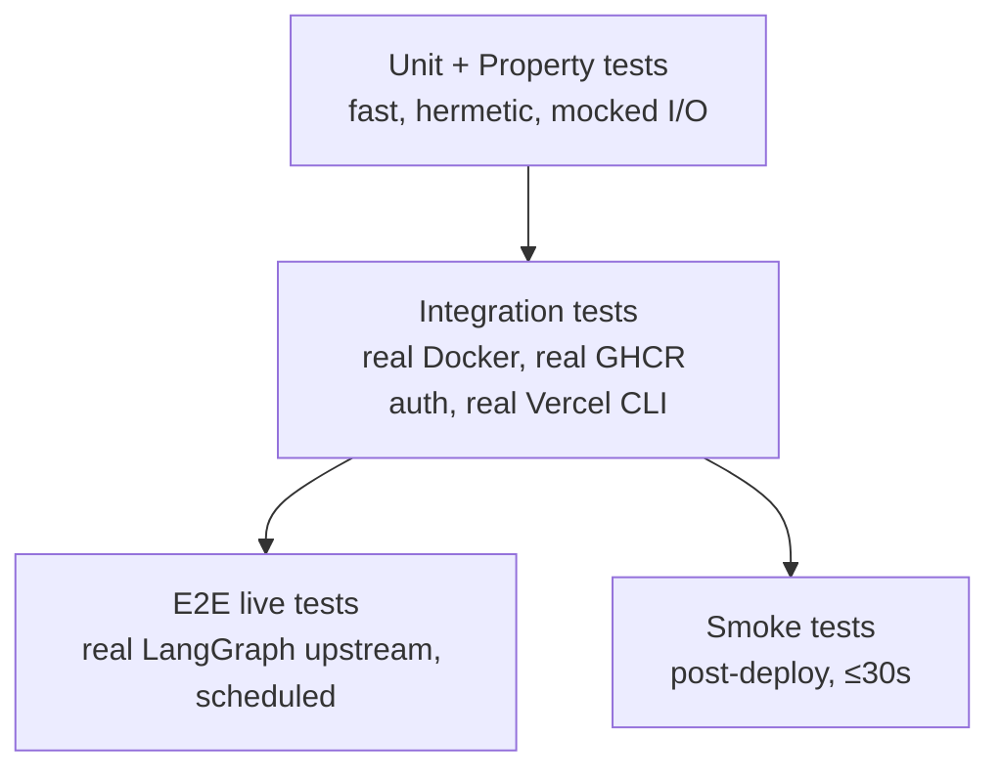

# Design Document

## Overview

This design realizes the four capabilities defined in `requirements.md`: (1) a discoverable root-level GitHub Actions CI suite, (2) a tag-and-merge-driven CD pipeline with auto-rollback, (3) a defensive LangGraph upstream contract with circuit breaker, and (4) a docker-compose-based supervisor that replaces the ad-hoc `tmp-*.log` pattern. The design maps every requirement (R1–R21) and every correctness property (CP-1–CP-8) to concrete artifacts, interfaces, and verification steps.

The chosen architecture deliberately favors **boring, reproducible primitives**: GitHub Actions for orchestration, GHCR for immutable images, docker-compose for runtime, and a small, audited Python client for the LangGraph upstream. There is no service mesh, no custom controller, and no bespoke deploy daemon — every deploy step is a script that an on-call operator can run by hand from the Runbook.

### Goals

- **Determinism**: same commit → same artifacts → same deploy outcome.
- **Atomicity**: frontend, backend, and LightRAG advance together or not at all.
- **Containment**: a degraded LangGraph upstream never takes down the admin dashboard.
- **Reversibility**: every migration can downgrade; every release can roll back to the prior `sha-*` image tag.
- **Auditability**: every secret declared once, every deploy recorded as a GitHub Deployment, every request logged with a `request_id`.

### Non-Goals

- Building a managed LangGraph replacement (R15 only requires that the contract is documented and swap-by-secret works).
- Multi-region or active-active topology — a single staging host and a single production host are sufficient for pilot scale.
- Custom secret stores beyond GitHub Actions secrets and host-level `.env` files mounted into containers.

### Source of Truth

- **CI/CD**: `.github/workflows/*.yml` at the repository root.
- **Runtime composition**: `docker-compose.yml` at the repository root (production), `web/apps/admin-dashboard/docker-compose.yml` (development overlay).
- **Operations**: `docs/runbooks/admin-dashboard.md`.
- **Smoke test**: `scripts/smoke_test.sh`.
- **LangGraph upstream URL**: secret `LANGGRAPH_UPSTREAM_URL`, initially `https://jajajou-bro.tail402a6.ts.net`.

## Architecture

### Repository layout (target state)

```
.
├── .github/
│   └── workflows/
│       ├── frontend-ci.yml
│       ├── backend-ci.yml
│       ├── langgraph-ci.yml
│       ├── e2e-live.yml
│       ├── docker-build-publish.yml
│       ├── release.yml
│       ├── staging-deploy.yml
│       └── production-deploy.yml
├── docker-compose.yml                          # production source of truth (R16.1)
├── docker-compose.override.yml                 # local dev tweaks (optional)
├── scripts/
│   ├── smoke_test.sh                           # R18
│   └── deploy/
│       ├── ssh_deploy.sh                       # used by staging/production workflows
│       └── rollback.sh
├── docs/
│   └── runbooks/
│       └── admin-dashboard.md                  # R15, R18, R20.8
├── web/apps/admin-dashboard/
│   ├── frontend/                               # admin_frontend image
│   ├── backend/                                # admin_backend image
│   │   ├── alembic/                            # migrations (R12)
│   │   └── app/clients/langgraph.py            # circuit breaker (R14)
│   └── docker-compose.yml                      # development overlay (R16.1)
├── LangGraph/                                  # langgraph_ci scope (R4)
└── LightRAG/                                   # lightrag image source
```

### CI/CD pipeline — high-level flow



### Production runtime topology



### Failure containment



When the breaker is `Open`, every LangGraph-dependent route returns HTTP 503 with `Structured_Error{code:"LANGGRAPH_UNAVAILABLE"}` (R14.4, R14.9). Non-LangGraph routes continue to serve normally — this is the heart of CP-4.

### Concurrency model for CI runs



Concurrency group: `${{ github.workflow }}-${{ github.ref }}` (R5.4).

## Components and Interfaces

### C1. Workflow file layout (R1, R5)

Each workflow lives at `.github/workflows/<name>.yml`. The path-filter contract is enforced by a single shared `paths:` block per workflow, expressed declaratively (no dynamic skipping inside the job) so that CP-7 is decidable from the YAML alone.

| Workflow | Trigger | Path filter | Concurrency group |
|---|---|---|---|
| `frontend-ci` | `pull_request`, `push: main` | `web/apps/admin-dashboard/frontend/**`, `.github/workflows/frontend-ci.yml` | `frontend-ci-${{ github.ref }}` |
| `backend-ci` | `pull_request`, `push: main` | `web/apps/admin-dashboard/backend/**`, `.github/workflows/backend-ci.yml` | `backend-ci-${{ github.ref }}` |
| `langgraph-ci` | `pull_request`, `push: main` | `LangGraph/**`, `.github/workflows/langgraph-ci.yml` | `langgraph-ci-${{ github.ref }}` |
| `e2e-live` | `schedule: 0 18 * * *`, `workflow_dispatch` | n/a | `e2e-live` |
| `docker-build-publish` | `push: main`, `push: tags v*` | n/a | `docker-build-publish-${{ github.ref }}` |
| `release` | `push: tags v*` | n/a | `release-${{ github.ref }}` |
| `staging-deploy` | `workflow_run: docker-build-publish on main` | n/a | `staging-deploy` |
| `production-deploy` | `push: tags v*`, `workflow_dispatch{image_tag}` | n/a | `production-deploy` |

Branch protection on `main` requires `frontend-ci`, `backend-ci`, and `langgraph-ci` (R2.7, R3.4, R4.4, R5.2).

### C2. Frontend CI workflow (R2)

Strict, ordered shell steps in `web/apps/admin-dashboard/frontend`:

1. `npm ci` (R19.2 — lockfile only, no resolution drift)
2. `npm run lint`
3. `npm run typecheck`
4. `npm run test -- --run` (vitest single run, no watch)
5. `npm run build`
6. `npm run test:e2e:mock` (Playwright mock config)

Step ordering is enforced by sequential `run:` steps, each starting only after `success` of the prior step (R2.2). Any non-zero exit halts the job and marks `conclusion=failure` (R2.3). Runner-level cancellation maps to `conclusion=cancelled` because no step exits non-zero in that path (R2.4).

Artifacts (uploaded with `if: success()` on the producing step):

- `admin-frontend-dist-${{ github.sha }}` — contents of `dist/`, retention 14 days (R2.5).
- `admin-frontend-coverage-${{ github.sha }}` — vitest coverage, retention 14 days (R2.6).

### C3. Backend CI workflow (R3, R12, R19)

Working directory: `web/apps/admin-dashboard/backend`. Job timeout: 20 minutes (R3.7).

1. Setup Python 3.11 with `actions/setup-python@v5` and pip cache.
2. **Lockfile guard** (R19.5): a small inline script that fails the run before `pip install` if any line in `requirements.txt` lacks an exact `==` pin. Pseudocode:
   ```bash
   awk 'NF && $0 !~ /^#/ && $0 !~ /==/ { print "Unpinned: " $0; bad=1 } END { exit bad }' requirements.txt
   ```
3. `pip install -r requirements.txt -r requirements-dev.txt`.
4. `ruff check .`.
5. **Conditional**: if `mypy.ini` or `pyproject.toml` declares `[tool.mypy]`, run `mypy app` (R3.5). The condition is a workflow `if:` evaluated from a prior step's `outputs`.
6. `pytest --cov=app --cov-report=xml`.
7. **Coverage gate** (R3.6): parse `coverage.xml` and fail if `line-rate < 0.70`.
8. **Alembic migration check** (R12.1–R12.4): three commands against an ephemeral SQLite file in `$RUNNER_TEMP`, each wrapped with `timeout 300`:
   ```bash
   export DATABASE_URL="sqlite:///${RUNNER_TEMP}/alembic_check.db"
   timeout 300 alembic upgrade head
   timeout 300 alembic downgrade base
   timeout 300 alembic upgrade head
   ```
   The job sets `set -o pipefail` and explicitly checks `$?` of every step so the workflow fails when any step exit code is non-zero, even if the runner mistakenly reports success (R12.4).
9. `if: always()` artifact upload of `coverage.xml` as `admin-backend-coverage-${{ github.sha }}`, retention 14 days (R3.3).

### C4. LangGraph CI workflow (R4)

Two paths, selected at workflow definition time:

- **Preferred**: `uses: ./LangGraph/.github/workflows/unit-tests.yml` and `uses: ./LangGraph/.github/workflows/integration-tests.yml` via `workflow_call`.
- **Fallback** (R4.2): if `workflow_call` is unavailable, a single job runs `pytest LangGraph/tests` from the repo root using the Python version declared in `LangGraph/.github/workflows/unit-tests.yml`.

Job-level `timeout-minutes: 30` enforces R4.1 / R4.3.

### C5. E2E live workflow (R6)

```mermaid
flowchart TD
    T[schedule 0 18 * * * or dispatch] --> S[Check LANGGRAPH_UPSTREAM_URL]
    S -->|empty| FAIL[Fail: secret missing]
    S -->|set| P[curl --max-time 5 ${URL}/health]
    P -->|2xx| PW[Run playwright.live.config.ts max 30m]
    P -->|non-2xx or timeout| SKIP[Skip Playwright, exit 0\nannotation: upstream unavailable]
    PW -->|exit 0| PASS[upload report 14d]
    PW -->|exit non-0 or >30m| FAIL2[Fail: e2e regression\ndistinct from skip]
```

The skip path (R6.5) deliberately exits 0 to prevent flaky alerts when the Tailscale endpoint is offline; the `playwright-report` artifact is still uploaded `if: always()` whenever Playwright actually ran (R6.6).

### C6. Docker build & publish (R7, R13.5–R13.8, R19)

Single matrix job over `[admin_backend, admin_frontend, lightrag]`:

```yaml
strategy:
  matrix:
    image:
      - { name: admin_backend,  context: web/apps/admin-dashboard/backend }
      - { name: admin_frontend, context: web/apps/admin-dashboard/frontend }
      - { name: lightrag,       context: LightRAG }
```

Per-image steps:

1. `docker/login-action@v3` to GHCR with `GITHUB_TOKEN` and `packages: write`. Up to 2 retries on auth failure (R7.8).
2. `docker/setup-buildx-action@v3`.
3. `docker/build-push-action@v5` with:
   - `build-args`: `GIT_SHA=${{ github.sha }}`, `BUILD_TIME=<ISO 8601 UTC>` computed once per workflow run (R7.4).
   - `secrets`: BuildKit `--secret` mounts only — never `build-args` or env files (R13.5).
   - `tags`: on `push: main` → `main`, `sha-${{ github.sha }}`; on tag `v*` → `${{ github.ref_name }}`, `latest` (R7.1, R7.2).
   - `provenance: true`, `sbom: true`.
   - `SOURCE_DATE_EPOCH` env set to `git show -s --format=%ct ${{ github.sha }}` (R19.4).
4. `cosign sign --yes ghcr.io/<owner>/<image>@<digest>` after successful push (R7.6).
5. **Secret scan** (R13.6, R13.7, R13.8): only on push jobs (not on PR cache builds). Pulls `aquasec/trivy:latest` and runs `trivy image --scanners secret`. Wrap with `timeout 600` — on timeout, fail the workflow without publishing untagged artifacts (the published image is left in GHCR but the workflow conclusion is `failure`, alerting operators).
6. **Reproducibility** (R7.5, R19.1, CP-6): a follow-up job re-builds the same matrix from the same commit on the same builder image and asserts that the layer digests for the application source layer and the dependency install layer match between runs. The job runs only on `push: main` and on tag pushes, in a separate job with `if: success()` on the build job.

If any step in a matrix slot fails, only that slot is marked failed; other slots proceed (R7.7).

### C7. Release workflow (R8)

Triggered on `push: tags v*`. Single job:

1. Resolve previous matching tag with `git describe --tags --abbrev=0 --match "v*" HEAD~1 || true`.
2. Call GitHub native release-notes generation API (`POST /repos/{owner}/{repo}/releases/generate-notes`) with `previous_tag_name` (or empty for first release per R8.5).
3. Append a fenced-code block listing `ghcr.io/<owner>/{admin_backend,admin_frontend,lightrag}:${{ github.ref_name }}` (R8.6).
4. `gh release create ${{ github.ref_name }} --title ${{ github.ref_name }} --notes-file body.md` within 120 seconds of trigger (R8.1).

Failure to call the API marks the workflow as failed (R8.2) without retry (R8.3) — the tag remains in place so a manual retry is straightforward.

### C8. Staging deploy (R9)

Trigger: `workflow_run: docker-build-publish, types: completed, branches: main` with `if: github.event.workflow_run.conclusion == 'success'`. Job timeout: 15 minutes (R9.2).



Both component deployments run in parallel (R9.3 — failure of one does not skip the other; the smoke test is the single source of truth). The rollback step uses a host-side `previous_image_tag` file written at the end of every successful deploy.

### C9. Production deploy (R10, R11, R12.5–R12.8)

Trigger: `push: tags v*` OR `workflow_dispatch` with required input `image_tag` (string, 1–128 chars). Environment: `production` (manual approval, 24h timeout — R10.3, R10.4).

**Pre-deploy duplicate-tag guard (R10.2)**: read the current `image_tag` from a host-side file `/etc/uit-docs/current_image_tag` over SSH; refuse the run if it equals the requested tag.

Deploy sequence:



Failure handling:

- Health probe fails within 60s → skip Vercel promote, run `Rollback_Procedure` for backend + lightrag (R11.2).
- Vercel promote returns error → run `Rollback_Procedure` for all three components within 300s (R11.3).
- Smoke test fails → run `Rollback_Procedure` (R10.8).
- `alembic upgrade head` non-zero or > 600s → abort, retain previous container, mark failed (R12.7).
- `Rollback_Procedure` runs `alembic downgrade <previous_revision>` from the file `/etc/uit-docs/previous_alembic_revision` written on the last successful deploy (R12.6); failure to downgrade halts rollback and notifies (R12.8).

The atomic-deploy invariant (CP-2 / R11.4) is enforced because Vercel promotion is conditional on backend health, and rollback is triggered for all three components on any failure path.

### C10. LangGraph upstream client (R14, R15)

Module path: `web/apps/admin-dashboard/backend/app/clients/langgraph.py`.



**Configuration loading (R14.1, R14.8)**: `LANGGRAPH_UPSTREAM_URL` is read once via Pydantic Settings on app startup. If unset, empty, or not a valid `http(s)` URL, the application emits a structured log entry with `code=LANGGRAPH_UPSTREAM_URL_MISSING` and exits with non-zero status before binding the HTTP port. This is enforced via `lifespan` startup guard so even tests cannot bypass it.

**Timeouts (R14.2)**: `httpx.Timeout(connect=5.0, read=30.0, write=30.0, pool=5.0)`.

**Retry policy (R14.3)**: implemented in `_with_retry` using `tenacity.AsyncRetrying`:
- Max 3 attempts (1 original + 2 retries).
- `wait_exponential(multiplier=0.5, min=0.5, max=4.0)`.
- Retry only on `httpx.ConnectError`, `httpx.ReadTimeout`, `httpx.WriteTimeout`, `httpx.PoolTimeout`, and 5xx responses.
- Never retry on 4xx.

**Circuit breaker (R14.4, R14.5)**: a deque-based sliding 60-second failure window. State transitions:

| From | Event | To | Effect |
|---|---|---|---|
| Closed | failure window count ≥ 5 | Open | start 30s probe timer |
| Open | new request | Open | return 503 immediately, no upstream call |
| Open | probe tick (every 30s) | HalfOpen | issue 1 probe to `/health` |
| HalfOpen | probe 2xx | HalfOpen with `success_count++`; if `success_count == 2` → Closed | reset window |
| HalfOpen | probe non-2xx or timeout | Open | reset success_count=0 |

The probe loop is an asyncio background task spawned during `lifespan` startup and cancelled on shutdown.

**Structured logging on failure (R14.6)**: every failed upstream call (after retries) emits exactly one log entry with `code=LANGGRAPH_UNAVAILABLE`, redacted upstream URL (credentials stripped via `urllib.parse`), `elapsed_ms`, and `request_id`. The log emission is wrapped in `try/except` so a logging failure cannot leak the upstream body to the client (R14.6).

**Health endpoint (R14.7, CP-8)**: `GET /healthz` reads `breaker.state` and returns:

| Breaker state | HTTP | Body |
|---|---|---|
| Closed | 200 | `{"status":"ok"}` |
| Open | 503 | `Structured_Error{code:"LANGGRAPH_UNAVAILABLE", ...}` |
| HalfOpen | 200 | `{"status":"ok"}` (treated as Closed for serving purposes; CP-8 only requires Closed↔200, Open↔503) |

**Migration target swap (R15)**: because the URL is read exclusively from `LANGGRAPH_UPSTREAM_URL` and the contract surface (`POST /threads`, `POST /threads/{id}/runs`, `GET /health`) is the only thing the client uses, a swap requires only updating the secret + the Runbook entry — no source change, no rebuild (R15.2).

### C11. Docker-compose supervisor (R16, R17)

Production `docker-compose.yml` (root) declares all five services: `admin_backend`, `admin_frontend`, `lightrag_uit`, `postgres_uit`, `qdrant_uit`. The development overlay `web/apps/admin-dashboard/docker-compose.yml` adds bind mounts and dev-specific env files.

Per-service hardening:

```yaml
admin_backend:
  image: ghcr.io/<owner>/admin_backend:${IMAGE_TAG}
  restart: unless-stopped                       # R16.2, R17.3
  healthcheck:                                   # R16.3
    test: ["CMD", "curl", "-fsS", "http://localhost:8001/healthz"]
    interval: 15s
    timeout: 3s
    retries: 3
    start_period: 30s
  logging:                                       # R17.1
    driver: json-file
    options:
      max-size: "20m"
      max-file: "5"
  stop_grace_period: 30s                         # R16.6, R16.7

admin_frontend:
  image: ghcr.io/<owner>/admin_frontend:${IMAGE_TAG}
  restart: unless-stopped
  healthcheck:                                   # R16.4
    test: ["CMD", "curl", "-fsS", "http://localhost/"]
    interval: 15s
    timeout: 3s
    retries: 3
    start_period: 30s
  logging: { driver: json-file, options: { max-size: "20m", max-file: "5" } }
  stop_grace_period: 30s
```

**Restart-loop backoff (R16.8)**: docker-compose's default restart policy does not implement quadratic backoff, so the design adds a sidecar pattern: a `supervisor-watchdog` script (host-side, run by systemd timer every 30s) that inspects `docker events` for `health_status: unhealthy` over a rolling 60s window per service. If a service has restarted ≥5 times in that window, the watchdog calls `docker compose stop <service>`, sleeps `min(120, 10 * 2^(restart_count-5))` seconds, then `docker compose start <service>`. The watchdog source lives at `scripts/supervisor_watchdog.sh` and is documented in the Runbook.

**Boot-on-host (R17.2)**: a systemd unit `uit-admin-dashboard.service` enables Docker daemon and runs `docker compose -f /opt/uit/docker-compose.yml up -d` at `multi-user.target`, expected to complete within 180 seconds of boot.

**Graceful shutdown (R16.6, R16.7)**: `stop_grace_period: 30s` ensures docker-compose forwards SIGTERM and waits up to 30s before SIGKILL. The systemd unit's `TimeoutStopSec=45s` accommodates this with a 15-second margin.

### C12. Smoke test script (R18)

`scripts/smoke_test.sh` (POSIX `bash`, no Python dependency on hosts):

```
Usage: smoke_test.sh --frontend-url URL --backend-url URL --upstream-url URL
```

Behavior:

1. Parse args — unknown arg or missing required arg → exit 1 with `Structured_Error{code:"BAD_ARG", ...}` to stdout (R18.4).
2. Issue three `curl` calls in parallel using `&` and `wait`, each with `--max-time 5 -o /dev/null -w "%{http_code} %{time_total}"`:
   - `${backend-url}/healthz`
   - `${frontend-url}/`
   - `${upstream-url}/health`
3. Aggregate results: any non-2xx status, any timeout, any DNS/TLS failure → exit 1 with a single-line JSON `Structured_Error` to stdout naming the failed URL, `status` (or `"timeout"`), and `elapsed_ms` (R18.3, R18.4).
4. Hard wall: total elapsed time ≤ 30 seconds (`SECONDS` shell builtin guarded) — otherwise exit 1.
5. All three 2xx within budget → exit 0, no stdout.

The script is invoked by the staging deploy (per-URL 30s, total 5min — R9.4 enforces a longer budget for staging) and the production deploy (total 30s — R10.7).

### C13. Observability surface (R17.5, R17.6)

**Structured request logs (R17.5)**: FastAPI middleware emits exactly one JSON line per request after the response, with fields `timestamp` (UTC ISO 8601), `request_id` (UUIDv4 from `X-Request-Id` or generated), `method`, `path`, `status`, `duration_ms` (clamped to `[0, 600000]`), `user_id_hash` (SHA-256 of subject claim, empty when unauthenticated). Implemented as a single `BaseHTTPMiddleware` to guarantee one log per request.

**Prometheus endpoint (R17.6)**: `prometheus-fastapi-instrumentator` exposes `/metrics` with:
- `http_requests_total{method,path,status}` (counter)
- `http_request_duration_seconds{method,path}` (histogram)
- `langgraph_upstream_failures_total{kind}` (counter, `kind ∈ {timeout, conn_error, http_5xx}`)
- `langgraph_circuit_state` (gauge: 0=Closed, 1=HalfOpen, 2=Open)

Endpoint must respond in ≤2s; the gauge is updated synchronously on every breaker state transition.

### C14. Secret management (R13)

All secrets enumerated in R13.1 are sourced from GitHub Actions encrypted secrets and surfaced to workflows via `${{ secrets.X }}`. They are never written to environment files inside built images (R13.5). The Runbook section "Required Secrets" lists each name, purpose, owner, and ≤90-day rotation cadence (R13.2).

Workflow patterns:

- Secrets used at runtime by containers (`POSTGRES_DSN`, `JWT_SECRET`, `LANGGRAPH_UPSTREAM_URL`, etc.) are written by the deploy script into `/opt/uit/.env` on the host (chmod 600, owned by the deploy user) and injected via `env_file:` in `docker-compose.yml`. The deploy script removes the previous `.env.bak` only after `docker compose up -d` returns success.
- Secrets used at build time for private package registries are mounted via `RUN --mount=type=secret,id=<name>` inside Dockerfiles.
- File-based secrets within a workflow step are written under `${{ runner.temp }}` and unconditionally deleted in an `if: always()` post-step (R13.4).

GitHub's automatic secret masking renders any secret value as `***` in logs (R13.3), and the Trivy secret scan (R13.6) is the post-build defense.

### C15. Production hardening (R20)

- **HTTPS everywhere (R20.1, R20.2)**: Vercel project configured with `redirects: [{ source: "http://...", destination: "https://...", permanent: true }]`.
- **Cookies (R20.3)**: cookie attributes `Secure; HttpOnly; SameSite=Lax; Path=/` set in `app/core/security.py` whenever `ENV == "production"`.
- **CORS (R20.4, R20.5)**: `CORSMiddleware` configured from env var `CORS_ALLOWED_ORIGINS` (comma-separated). On parse failure or empty value, the app installs a deny-all middleware that returns 403 + structured log `code=CORS_MISCONFIGURED`.
- **Trusted hosts (R20.6, R20.7)**: Starlette `TrustedHostMiddleware` configured from `TRUSTED_HOSTS`. Empty/unset → reject with HTTP 400 + `code=TRUSTED_HOSTS_MISCONFIGURED`. The trusted-host check runs **before** CORS so a malicious `Host` header is rejected even when the `Origin` is allowed (R20.6).
- **Runbook (R20.8)**: lists the production values and the production domain.

### C16. PR status reporting (R21)

A small reusable workflow `pr-status-summary.yml` runs on `workflow_run` for each of the eight workflows. It:

1. Looks up an existing comment on the PR authored by `github-actions[bot]` whose body starts with the marker `<!-- pr-status-summary:v1 -->`.
2. If found, **edits** the comment in place (R21.2, R21.4).
3. If not found, **creates** exactly one comment (R21.3).
4. Posts/updates the per-workflow status check via `POST /repos/{owner}/{repo}/statuses/{sha}` with `context = workflow filename without extension` and `state ∈ {success, failure}` within 30 seconds (R21.1).

The marker comment ensures idempotent updates; the workflow never modifies any other comment (R21.4).

## Data Models

### D1. `Structured_Error`

The single error envelope returned by the backend and printed by the smoke test on failure.

```json
{
  "code": "LANGGRAPH_UNAVAILABLE",
  "message": "Upstream did not respond within retry budget.",
  "request_id": "8d6f7a2e-4b1c-4f3e-9a1d-2c5e8b0a1f2d",
  "timestamp": "2025-01-15T12:34:56Z"
}
```

Fields (all required):

| Field | Type | Notes |
|---|---|---|
| `code` | string | Stable machine identifier from the closed set: `LANGGRAPH_UNAVAILABLE`, `LANGGRAPH_UPSTREAM_URL_MISSING`, `CORS_MISCONFIGURED`, `TRUSTED_HOSTS_MISCONFIGURED`, `BAD_ARG`, `SMOKE_TIMEOUT`, `SMOKE_HTTP_FAIL`. |
| `message` | string | Human-readable, never contains secret values. |
| `request_id` | string | Non-empty UUID/ULID from `X-Request-Id` or freshly generated. |
| `timestamp` | string | UTC ISO 8601, second precision. |

The same shape is used by `scripts/smoke_test.sh` so an operator sees identical structure across CI logs and runtime errors.

### D2. `WorkflowEvent` and `Path_Filter`

Modeled as a pure function `triggered_workflows: (Event, Set[Workflow]) -> Set[Workflow]`.

```python
@dataclass(frozen=True)
class Event:
    kind: Literal["pull_request", "push", "tag_push", "schedule", "workflow_dispatch", "workflow_run"]
    ref: str                      # branch ref or tag ref
    changed_files: frozenset[str] # empty for non-fs events

@dataclass(frozen=True)
class Workflow:
    name: str                     # e.g. "frontend-ci"
    file_path: str                # ".github/workflows/frontend-ci.yml"
    triggers: frozenset[str]      # {"pull_request","push:main",...}
    path_filter: tuple[str, ...]  # glob patterns

def matches(workflow: Workflow, event: Event) -> bool:
    if not _trigger_matches(workflow, event):
        return False
    if not workflow.path_filter:                         # workflows without filters always match
        return True
    return any(fnmatch.fnmatch(f, p)
               for f in event.changed_files
               for p in workflow.path_filter)
```

This is the model under test for CP-7.

### D3. `DeploymentManifest`

Stored on the host at `/etc/uit-docs/deployment.json` after every successful deploy.

```json
{
  "deployed_at": "2025-01-15T12:34:56Z",
  "image_tag": "v1.4.2",
  "previous_image_tag": "v1.4.1",
  "alembic_revision": "f3a1b2c4d5e6",
  "previous_alembic_revision": "a1b2c3d4e5f6",
  "git_sha": "deadbeef..."
}
```

Used by:

- The duplicate-tag guard (R10.2).
- The rollback procedure (R10.8, R11, R12.6).

### D4. `CircuitBreakerState`

```python
@dataclass
class CircuitBreakerState:
    state: Literal["closed", "open", "half_open"]
    failure_window: deque[float]  # timestamps of failures within last 60s
    half_open_successes: int
    opened_at: float | None
    last_probe_at: float | None
```

Invariants enforced by the breaker:
- `state == "closed"` ⇒ `half_open_successes == 0` and `opened_at is None`.
- `state == "open"` ⇒ `len(failure_window) ≥ 5`.
- `state == "half_open"` ⇒ `0 ≤ half_open_successes < 2`.

### D5. `SmokeTestProbeResult`

```python
@dataclass(frozen=True)
class ProbeResult:
    url: str
    status: int | Literal["timeout", "dns_error", "tls_error"]
    elapsed_ms: int
    ok: bool                      # True iff 200 <= status <= 299

@dataclass(frozen=True)
class SmokeReport:
    probes: tuple[ProbeResult, ProbeResult, ProbeResult]
    total_elapsed_ms: int
    exit_code: int                # 0 if all .ok and total_elapsed_ms <= 30000 else 1
```


## Correctness Properties

*A property is a characteristic or behavior that should hold true across all valid executions of a system — essentially, a formal statement about what the system should do. Properties serve as the bridge between human-readable specifications and machine-verifiable correctness guarantees.*

PBT applies to this feature because the testable surface area decomposes into pure functions and small state machines: path-filter matching, retry policies, the LangGraph circuit breaker, the deploy-rollback state machine, the smoke-test contract, and several declarative configuration validators. The deploy infrastructure pieces that are not pure (Vercel API, GHCR push, Docker daemon) are treated as integration tests with mocks for property-based runs.

After completing the prework analysis, the redundant per-criterion properties were consolidated under CP-1..CP-8. The resulting property set follows.

### Property 1: Path-Filter Correctness

*For any* set of changed files `F` and the declared CI workflow set `W` with their path filters, the set of triggered workflows SHALL equal `{ w ∈ W : path_filter(w) = ∅ ∨ ∃ f ∈ F . ∃ pattern ∈ path_filter(w) . fnmatch(f, pattern) }`. Equivalently, a workflow is triggered iff it has no path filter or its filter matches at least one changed file.

**Validates: Requirements 1.2, 1.3, 1.4, 1.5, 1.6, 1.7, 1.8**

Implements correctness property **CP-7**.

### Property 2: Deployment Atomicity

*For any* failure injected at any step of the production deploy state machine (alembic upgrade, backend container start, lightrag container start, backend health probe, lightrag health probe, Vercel promotion, smoke test), the final observable state of the system SHALL satisfy one of the following: (a) all three components — `admin_frontend`, `admin_backend`, `lightrag_uit` — are at the new release version and the deploy is marked successful, or (b) all three components are at the previous release version and the deploy is marked failed. No mixed-version end state is permitted.

**Validates: Requirements 9.5, 10.8, 11.1, 11.2, 11.3, 11.4, 11.5, 12.7, 12.8**

Implements correctness property **CP-2**.

### Property 3: Secret Hygiene

*For any* secret name `s` listed in Requirement 13.1 and any container image `I` published by `Docker_Build_Workflow`, the plaintext value of `s` SHALL NOT appear in any layer of `I`, in any image environment variable, in workflow logs, or in any uploaded artifact.

**Validates: Requirements 13.3, 13.5, 13.6, 13.7, 13.8**

Implements correctness property **CP-3**.

### Property 4: Upstream Isolation

*For any* failure mode of `LangGraph_Upstream` from the set {connection refused, DNS failure, connect timeout, read timeout, HTTP 5xx}, every `Admin_Backend` route that does not depend on `LangGraph_Upstream` SHALL respond with HTTP 200 (assuming no other faults), and every route that does depend on `LangGraph_Upstream` SHALL respond with HTTP 503 carrying `Structured_Error{code:"LANGGRAPH_UNAVAILABLE"}`. The raw upstream response body SHALL never appear in any response sent to the `Admin_User`.

**Validates: Requirements 14.4, 14.6, 14.9**

Implements correctness property **CP-4**.

### Property 5: Migration Reversibility

*For any* Alembic migration revision `r` reachable from the baseline, the command sequence `alembic upgrade head` → `alembic downgrade base` → `alembic upgrade head`, run against an ephemeral SQLite database with no other migrations applied, SHALL complete with exit status 0 for every command within the 300-second per-command bound.

**Validates: Requirements 12.1, 12.2, 12.3, 12.4**

Implements correctness property **CP-5**.

### Property 6: Build Reproducibility

*For any* commit SHA `c`, any image name `I ∈ {admin_backend, admin_frontend, lightrag}`, and any builder image version `B`, two consecutive builds of `I` from `c` on `B` with identical build arguments and lockfiles SHALL produce manifest layer digests for the application-source layer and the dependency-install layer that are byte-for-byte identical.

**Validates: Requirements 7.5, 19.1, 19.2, 19.3, 19.4**

Implements correctness property **CP-6**.

### Property 7: Health-Endpoint Consistency

*For any* state `S` of the LangGraph circuit breaker, a `GET /healthz` request to `Admin_Backend` SHALL return HTTP 200 with body `{"status":"ok"}` when `S = Closed` (or `HalfOpen`), and HTTP 503 with `Structured_Error{code:"LANGGRAPH_UNAVAILABLE"}` when `S = Open`.

**Validates: Requirements 14.7**

Implements correctness property **CP-8**.

### Property 8: CI Idempotency

*For any* commit SHA `c` and any workflow `W ∈ {frontend-ci, backend-ci, langgraph-ci}`, two runs of `W` against `c` on the same runner image and same lockfiles SHALL produce the same workflow conclusion (`success` or `failure`), the same set of test names with the same per-test pass/fail outcome, and the same set of uploaded artifact filenames.

**Validates: Requirements 2.1, 2.2, 2.3, 3.1, 3.2, 3.3, 4.1, 4.2, 4.3**

Implements correctness property **CP-1** (CI idempotency across the three quality-gate workflows).

### Property 9: LangGraph Retry Policy

*For any* finite sequence of upstream response outcomes `R = (r_1, r_2, …)` where each `r_i ∈ {2xx, 4xx, 5xx, conn_error, timeout}`, the `LangGraphClient.request` call SHALL: (a) issue at most 3 attempts (1 original + 2 retries); (b) terminate immediately on the first 2xx or any 4xx; (c) retry only when the latest outcome is one of {5xx, conn_error, timeout}; (d) place a delay between attempts drawn from `[500ms, 4000ms]` following exponential backoff with multiplier 2; and when the breaker is closed and 5 or more failures occur within any rolling 60-second window, the breaker SHALL transition to `Open`.

**Validates: Requirements 14.3, 14.4, 14.5**

### Property 10: Smoke Test Contract

*For any* triple of URLs `(F, B, U)` and any combination of mocked HTTP outcomes for the probes `B/healthz`, `F/`, `U/health`, the script `scripts/smoke_test.sh --frontend-url F --backend-url B --upstream-url U` SHALL exit with status 0 if and only if all three probes complete with HTTP status in `[200, 299]` within their per-request 5-second budget AND the total elapsed time is at most 30 seconds; otherwise the script SHALL exit with status 1 and print exactly one `Structured_Error` JSON line to stdout naming the first-failing URL, its observed status (or `"timeout"`), and elapsed milliseconds.

**Validates: Requirements 18.1, 18.2, 18.3, 18.4**

### Property 11: Config Validation at Startup

*For any* environment variable triplet `(LANGGRAPH_UPSTREAM_URL, CORS_ALLOWED_ORIGINS, TRUSTED_HOSTS)` presented to `Admin_Backend` at startup, the process SHALL: (a) terminate startup with `code=LANGGRAPH_UPSTREAM_URL_MISSING` iff `LANGGRAPH_UPSTREAM_URL` is unset, empty, or not a syntactically valid `http`/`https` URL; (b) install a deny-all CORS handler logging `code=CORS_MISCONFIGURED` iff `CORS_ALLOWED_ORIGINS` is unset, empty, or unparseable; (c) install a deny-all trusted-host handler logging `code=TRUSTED_HOSTS_MISCONFIGURED` iff `TRUSTED_HOSTS` is unset, empty, or unparseable.

**Validates: Requirements 14.1, 14.8, 20.4, 20.5, 20.6, 20.7**

### Property 12: Tag Computation

*For any* trigger event `e` of type `push:main` or `push:tag` with associated `ref` and `sha`, the set of image tags pushed to GHCR SHALL equal: `{"main", "sha-" + sha}` when `e` is `push:main`, and `{ref_name, "latest"}` when `e` is `push:tag` matching `v*`.

**Validates: Requirements 7.1, 7.2, 7.4**

### Property 13: Coverage Gate

*For any* `coverage.xml` file with a `line-rate` attribute `r`, the backend coverage gate step SHALL exit 0 iff `r ≥ 0.70` and exit non-zero otherwise.

**Validates: Requirements 3.6**

### Property 14: Structured Request Log

*For any* HTTP request handled by `Admin_Backend`, exactly one log line SHALL be emitted, in valid JSON, containing all of the fields `timestamp`, `request_id`, `method`, `path`, `status`, `duration_ms`, `user_id_hash`, with `timestamp` parseable as ISO 8601 UTC, `request_id` a non-empty string, `status` an integer in `[100, 599]`, `duration_ms` an integer in `[0, 600000]`, and `user_id_hash` empty when the request is unauthenticated.

**Validates: Requirements 17.5**

### Property 15: Production Cookie Hardening

*For any* authentication cookie issued by `Admin_Backend` while running in the `production` environment, the corresponding `Set-Cookie` response header SHALL contain the attributes `Secure`, `HttpOnly`, and `SameSite=Lax`.

**Validates: Requirements 20.3**

### Property 16: Supervisor Restart-Loop Backoff

*For any* sequence of restart events for a single managed service, after the count of restarts within a rolling 60-second window reaches `n ≥ 5`, the watchdog's next restart attempt SHALL be delayed by `min(120, 10 * 2^(n-5))` seconds.

**Validates: Requirements 16.8**

### Property 17: PR Status Comment Idempotency

*For any* finite sequence of workflow-run completions associated with a single PR, after the last completion has been processed by the PR-status reusable workflow, exactly one summary comment authored by `github-actions[bot]` and bearing the marker `<!-- pr-status-summary:v1 -->` SHALL exist on that PR, and its body SHALL reflect the most recent run's results. No other comments authored by `github-actions[bot]` on that PR SHALL be modified.

**Validates: Requirements 21.2, 21.3, 21.4**

## Error Handling

### E1. Error envelope

All errors surfaced by `Admin_Backend` and `scripts/smoke_test.sh` use the `Structured_Error` envelope (Data Model D1). The closed code set is enumerated in D1; new codes require a design-review change because they are part of the public contract.

### E2. CI workflow errors

| Error category | Detection | Handling | Operator action |
|---|---|---|---|
| Lockfile drift (`requirements.txt` unpinned) | Backend CI lockfile guard | Fail before `pip install` (R19.5) | Pin the offending package; rerun. |
| Coverage below 70% | Backend CI coverage gate | Mark workflow failed (R3.6) | Add tests; rerun. |
| Alembic migration not reversible | Backend CI migration check | Mark workflow failed (R12.2) | Edit migration `downgrade()` or revert. |
| Job timeout (frontend 20m? back 20m, langgraph 30m) | Workflow `timeout-minutes` | Workflow runner kills the job | Investigate flake or split tests. |
| Auth failure to GHCR | `docker/login-action` exit code | Retry up to 2x (R7.8); fail run after | Rotate `GITHUB_TOKEN` permissions. |
| Trivy secret-scan timeout (>600s) | Workflow `timeout` wrapper | Fail closed (R13.7) | Investigate scanner; do not bypass. |
| Reproducibility mismatch | Layer-digest diff job | Fail run | Compare lockfiles, builder image, build args. |

### E3. Deploy errors



`Notify` writes a structured failure message to the configured webhook (Slack/Teams/email — operator's choice; the workflow only requires that exactly one notification is emitted within 2 minutes, R9.6). The notification body contains the failing component, stage, run URL, and current `image_tag`.

### E4. Runtime errors (`Admin_Backend`)

| Condition | Response | Log entry |
|---|---|---|
| LangGraph upstream all retries exhausted | HTTP 503 + `Structured_Error{code:"LANGGRAPH_UNAVAILABLE"}` | `code=LANGGRAPH_UNAVAILABLE`, redacted URL, elapsed_ms, request_id |
| Circuit breaker open | HTTP 503 + same envelope, no upstream call | `code=CIRCUIT_OPEN_SHORT_CIRCUIT` (debug-level) |
| Missing `LANGGRAPH_UPSTREAM_URL` at startup | Process exits non-zero | `code=LANGGRAPH_UPSTREAM_URL_MISSING` |
| Origin not in `CORS_ALLOWED_ORIGINS` | HTTP 403 | none (CORS rejection is normal) |
| `Host` not in `TRUSTED_HOSTS` | HTTP 400 | none |
| `CORS_ALLOWED_ORIGINS` misconfigured | All cross-origin → 403 | `code=CORS_MISCONFIGURED` |
| `TRUSTED_HOSTS` misconfigured | All requests → 400 | `code=TRUSTED_HOSTS_MISCONFIGURED` |

The trusted-host check runs **before** CORS so a malicious `Host` header is rejected with HTTP 400 even when its `Origin` is allowed (R20.6 phrasing).

### E5. Smoke test errors

The script never raises; every error path exits 1 and prints exactly one JSON line of `Structured_Error` to stdout. Codes emitted: `BAD_ARG`, `SMOKE_HTTP_FAIL` (non-2xx), `SMOKE_TIMEOUT` (per-URL 5s exceeded), `SMOKE_DNS_ERROR`, `SMOKE_TLS_ERROR`, `SMOKE_BUDGET_EXCEEDED` (overall 30s). The deploy workflow's `on-failure` step parses this JSON to populate the operator notification.

### E6. Supervisor errors

| Condition | Behavior |
|---|---|
| Service exits non-zero or transitions to `unhealthy` | docker-compose `restart: unless-stopped` restarts within 10s (R16.5) |
| ≥5 restarts in 60s | Host-side watchdog applies exponential backoff `min(120, 10*2^(n-5))` (R16.8) |
| SIGTERM received | docker-compose forwards within 1s (R16.6); SIGKILL after 30s grace period (R16.7) |
| Host reboots | systemd unit starts compose stack within 180s (R17.2) |

## Testing Strategy

### T1. Test pyramid



### T2. Unit and property tests (fast, hermetic)

**Where**: `web/apps/admin-dashboard/backend/tests/` for Python; `web/apps/admin-dashboard/frontend/tests/` for TS; `tests/cicd/` (new) for workflow-logic unit tests; `tests/scripts/` for `smoke_test.sh`.

**Tooling**:

- **Python PBT**: [Hypothesis](https://hypothesis.readthedocs.io/) for `app/clients/langgraph.py`, the coverage gate parser, the request-log middleware, the cookie hardening, the CORS / trusted-host validators, the watchdog backoff function, and the deploy state machine simulator.
- **TS PBT**: [fast-check](https://github.com/dubzzz/fast-check) for the path-filter simulator and the tag-computation logic if implemented in JS for status reporting; otherwise these run as Python tests.
- **Bash PBT**: a small Python harness (`tests/scripts/test_smoke_test.py`) that uses Hypothesis to spawn local HTTP servers with random response patterns, then invokes `scripts/smoke_test.sh` and asserts exit code + stdout structure.

**Configuration**:

- Each property test runs **at minimum 100 iterations** (Hypothesis `max_examples=100`; fast-check `numRuns: 100`).
- Each property test is tagged with a comment: **Feature: cicd-deploy-admin-dashboard, Property N: <property text>**.
- Each property is implemented by **exactly one** property-based test.

**Property → test mapping**:

| Property | Test file | Generator | Assertion |
|---|---|---|---|
| P1 Path-filter correctness | `tests/cicd/test_path_filter.py` | random subsets of `repo_files()` | `triggered_set == predicted_set` |
| P2 Deployment atomicity | `tests/cicd/test_deploy_state_machine.py` | random failure-injection point ∈ {migrate, backend_up, lightrag_up, backend_health, lightrag_health, vercel, smoke} | final state ∈ {all_new_success, all_old_failed} |
| P3 Secret hygiene | `tests/cicd/test_secret_scan.py` | random sentinel strings injected into a test image | scan exit code 1 ⇔ sentinel present |
| P4 Upstream isolation | `tests/clients/test_langgraph_isolation.py` | random failure mode ∈ {conn_refused, dns, connect_timeout, read_timeout, http_500..504}; random route ∈ {langgraph_route, non_langgraph_route} | 200 for non-LG routes, 503 + LANGGRAPH_UNAVAILABLE for LG routes; never raw upstream body in response |
| P5 Migration reversibility | `tests/migrations/test_round_trip.py` | iterates over all revisions in the migration tree | `upgrade head → downgrade base → upgrade head` exits 0 each step |
| P6 Build reproducibility | CI job `build-twice` (one job per image, run on push:main and tag pushes) | repository commit set | layer digests match between two builds |
| P7 Health endpoint consistency | `tests/clients/test_healthz_state.py` | random breaker states (Closed, Open, HalfOpen with 0..1 successes) | response code per Property 7 |
| P8 CI idempotency | scheduled `ci-idempotency` workflow | small set of canonical commits | replay → identical conclusions, test names, artifact names |
| P9 Retry policy | `tests/clients/test_retry_policy.py` | random response sequences | attempt count + delays in [500ms, 4s] + breaker transitions match policy |
| P10 Smoke test contract | `tests/scripts/test_smoke_test.py` | random response patterns from local HTTP servers | exit + stdout per Property 10 |
| P11 Config validation | `tests/core/test_startup_config.py` | random env-var triplets | startup outcome + log code per Property 11 |
| P12 Tag computation | `tests/cicd/test_tag_computation.py` | random (event_kind, ref, sha) tuples | tag set per Property 12 |
| P13 Coverage gate | `tests/cicd/test_coverage_gate.py` | random `coverage.xml` line-rate values | exit 0 ⇔ ≥0.70 |
| P14 Structured request log | `tests/middleware/test_request_log.py` | random method/path/status/duration | exactly one log line with all required fields and types |
| P15 Production cookie hardening | `tests/core/test_cookies.py` | random cookie values | Secure + HttpOnly + SameSite=Lax always present in production env |
| P16 Watchdog backoff | `tests/scripts/test_watchdog_backoff.py` | random restart event timestamps | next-delay = min(120, 10*2^(n-5)) |
| P17 PR status idempotency | `tests/cicd/test_pr_status.py` | random sequences of workflow-run completions | exactly one marker comment, body matches latest run |

### T3. Example-based unit tests

Used for criteria classified as `EXAMPLE` or `EDGE_CASE`:

- Frontend Vitest existing 89 tests (lint, typecheck, render).
- Backend Pytest existing 68 tests (unauthenticated endpoints, upload validation, etc.).
- New: a small set of fixed-input tests for runbook content checks (R15, R18.5, R18.6, R20.8) — these assert that named sections exist in `docs/runbooks/admin-dashboard.md`.

### T4. Integration tests

| Test | What it verifies | When |
|---|---|---|
| Workflow YAML lint | Every workflow file parses; required jobs, triggers, path filters present | Every PR (`actionlint` step in `frontend-ci` and `backend-ci`) |
| Branch protection check | API call confirms protection rules include the three required CI checks | Daily scheduled job |
| Docker build & push (real GHCR) | Auth + push + cosign sign + Trivy scan succeed end-to-end | `push: main` and `push: tags v*` |
| `staging-deploy` smoke run | Full pipeline against the staging host | Every merge to `main` |
| `production-deploy` dry-run | Same pipeline against a staging-prod environment with deliberate failure injection | Manual dispatch before each release |
| LangGraph upstream live probe | `e2e-live` workflow against the Tailscale endpoint | Daily 18:00 UTC |
| Compose supervisor lifecycle | `docker compose up -d`, kill backend, observe restart, send SIGTERM, observe shutdown ≤30s | Manual on staging host before release |
| systemd boot test | Reboot staging host, verify stack up within 180s | Quarterly |

### T5. Smoke tests

Post-deploy verification by `scripts/smoke_test.sh` is the gate that arms rollback. It is run unchanged from staging (5-minute budget, R9.4) and production (30-second budget, R10.7) deploys.

### T6. Test environment matrix

| Environment | Compose file | Image tag | Used for |
|---|---|---|---|
| Local dev | `web/apps/admin-dashboard/docker-compose.yml` | `:dev` (locally built) | Developer iteration |
| CI | ephemeral `docker compose` in workflow | `sha-<short>` | Integration & supervisor lifecycle tests |
| Staging | `docker-compose.yml` (root) on `STAGING_SSH_HOST` | `main` or `sha-<sha>` | Auto-deployed on every merge |
| Production | `docker-compose.yml` (root) on `PROD_SSH_HOST` | `vX.Y.Z` or `latest` | Tag-driven releases |

### T7. Verification matrix (requirement → test)

| Requirement | Verified by |
|---|---|
| R1 (CI workflow layout) | YAML lint + Property 1 |
| R2 (Frontend CI gates) | YAML lint + integration runs + existing 89 vitest tests |
| R3 (Backend CI gates) | YAML lint + integration runs + existing 68 pytest tests + Property 13 |
| R4 (LangGraph CI) | YAML lint + LangGraph's own test suite |
| R5 (Parallel execution) | YAML lint (concurrency group) + integration |
| R6 (E2E live) | Property 11 (secret presence) + integration daily run |
| R7 (Image build/publish) | Property 6, Property 12 + integration build job |
| R8 (Release generation) | Integration on tag push + content-check unit test on body template |
| R9 (Staging deploy) | Property 2 + integration on every merge |
| R10 (Production deploy) | Property 2 + integration dry-run + duplicate-tag guard unit test |
| R11 (Atomic deploy) | Property 2 |
| R12 (Migration safety) | Property 5 + integration |
| R13 (Secrets) | Property 3 + secret-scan integration |
| R14 (LangGraph contract) | Property 4, Property 7, Property 9, Property 11 |
| R15 (Migration plan) | Runbook content unit test |
| R16 (Supervisor) | YAML lint + Property 16 + integration lifecycle test |
| R17 (Logging/observability) | Property 14 + smoke endpoint check for /metrics |
| R18 (Smoke test) | Property 10 + runbook content unit test |
| R19 (Build reproducibility) | Property 6 + lockfile-guard unit test |
| R20 (Production hardening) | Property 11, Property 15 |
| R21 (PR status) | Property 17 |

### T8. Approval gate

Before merging this design, the following must be true:

1. `requirements.md` exists and has been approved (verified — file present with 21 requirements + 8 correctness properties).
2. Every requirement clause appears in the verification matrix T7.
3. Every correctness property CP-1..CP-8 is mapped to at least one numbered Property above.
4. No design decision contradicts any requirement clause.

### T9. Open design decisions to confirm with operator

These items have a defensible default in this design but warrant explicit operator sign-off before tasks.md is generated:

1. **Notification channel** for deploy failures (R9.6, R11.5, R12.8) — design assumes a configurable webhook URL stored as secret `DEPLOY_FAILURE_WEBHOOK_URL`. Slack vs Teams vs email is operator-choice.
2. **Cosign keyless vs keyed signing** (R7.6) — design assumes keyless OIDC signing via Sigstore using the workflow's GitHub OIDC token. A keyed alternative requires a secret `COSIGN_PRIVATE_KEY` and rotation cadence.
3. **Restart-loop watchdog deployment** (R16.8) — design assumes a host-side bash script run by a systemd timer. An alternative is a sidecar container, which simplifies host setup but adds a moving part.
4. **Vercel project owner identity** — design assumes a single Vercel team token; if the production project lives in a separate Vercel team, that requires a second token.
5. **Reproducibility tolerance** (R7.5, R19.1, Property 6) — design treats the application-source layer and the dependency-install layer as the bytes-identical surface. Other layers (base OS, build tooling) inherit reproducibility from the builder image but are not asserted; this matches the requirement language "layers containing application source code and installed dependencies".
