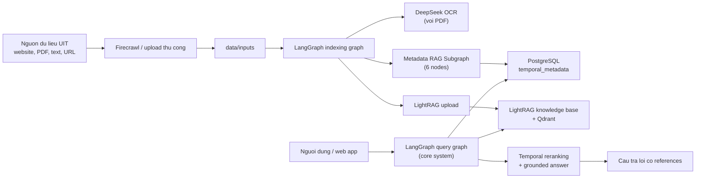

# UIT_DOCS_AGENT - Phan tich he thong va de cuong 13 slide

## 1. Pham vi phan tich va cach doc tai lieu

- Tai lieu nay duoc tong hop tu **snapshot local hien tai** cua repo `uit_firecrawl_new` ngay `2026-04-14`.
- Theo yeu cau, **khong fetch/pull remote**. Moi nhan dinh ben duoi phan anh dung trang thai local hien tai, ke ca cac thay doi chua commit.
- Nguon phan tich chinh:
  - source code trong `LangGraph/`, `LightRAG/`, `firecrawl/`, `web/`
  - tai lieu noi bo: `README.md`, `CHANGELOG.md`, `docs/ARCHITECTURE_DIAGRAM.md`, `docs/implementation/*`, `web/docs/admin-dashboard/WEB_PROJECT_MASTER_STATUS.md`
  - git history local (`git log`, `git diff --stat`)
- Ngu canh GitNexus da duoc dung o muc **ban do codebase**, khong dung o muc "current truth":
  - repo co `.gitnexus/meta.json`
  - chi muc GitNexus cuoi cung: `2026-04-02T03:51:36.987Z`
  - thong ke index: `4424 files`, `46322 nodes`, `120003 edges`, `300 processes`
  - `CLAUDE.md` cung ghi repo duoc GitNexus index voi `46322 symbols`, `120003 relationships`, `300 execution flows`
- Gioi han GitNexus trong session nay:
  - MCP GitNexus khong duoc mount
  - `npx gitnexus status` khong chay duoc vi moi truong offline / bi chan
  - vi vay, GitNexus duoc dung nhu **nguon bo tro de xac nhan quy mo, modules, execution-flow mindset**, con **source code hien tai** va tai lieu local la nguon xac thuc cuoi cung

## 2. Ket luan ngan gon nhat

`UIT_DOCS_AGENT` khong chi la mot chatbot. Day la mot **nen tang RAG co quan ly tinh thoi gian cua van ban**, gom 4 lop lon:

1. thu thap du lieu tu website va tai lieu thu cong
2. indexing + trich xuat metadata thoi gian
3. kho tri thuc graph/vector + metadata temporal
4. lop tra loi va lop giao dien web van hanh

Ba y quan trong nhat can nho:

- **Diem khac biet cot loi** cua he thong la temporal-aware RAG: khong chi tim van ban lien quan, ma con uu tien van ban con hieu luc, dung cohort, dung quan he sua doi
- **Pipeline query core hien tai da don gian hoa** thanh 2-agent, 7 node; Agent 2 da bi loai bo o `v0.2.0`
- **`/web` hien tai la mot BFF + SPA contract-first** rat manh cho van hanh tai lieu, nhung chua phai la lop UI dong nhat hoan toan tren toan bo LangGraph pipeline; live mode hien tai chu yeu proxy truc tiep vao LightRAG

## 3. Van de ma he thong giai quyet

Trong boi canh UIT, tri thuc van hanh bi phan tan tren nhieu nguon:

- website truong va cac don vi
- thong bao hoc vu
- quy che, quy dinh, quyet dinh
- email noi bo
- file PDF / DOCX / form / huong dan

Ba kho khan ky thuat lon nhat:

1. **Thong tin phan manh**
   - mot cau hoi co the can noi thong tin tu nhieu tai lieu khac nhau
2. **Tai lieu co tinh thoi gian**
   - van ban co ngay hieu luc, ngay het hieu luc, van ban sua doi van ban cu
3. **Tinh ap dung theo doi tuong**
   - cung mot van de nhung khac nhau theo khoa sinh vien, nam hoc, don vi

Neu chi dung RAG thong thuong:

- he thong de tra ve van ban cu nhung semantically van giong
- khong phan biet duoc "van ban hien hanh" va "van ban da bi thay the"
- khong giai thich tot tai sao cau tra loi nay dung cho K2020 nhung khong dung cho K2024

## 4. Ban do he thong tong the

### 4.1. Thanh phan chinh

| Thanh phan | Vai tro | Duong dan chinh |
| --- | --- | --- |
| `firecrawl/` | Crawl website, dua du lieu ve dang co the index | `firecrawl/`, `firecrawl/docker-compose.yaml` |
| `LangGraph/` | Dieu phoi indexing va query pipeline | `LangGraph/src/agent/graphs/` |
| `LightRAG/` | Kho tri thuc graph + retrieval API | `LightRAG/`, root `docker-compose.yml` |
| `PostgreSQL` | Luu temporal metadata, document status, dashboard DB | root `docker-compose.yml`, `docker/init-admin-dashboard-db.sql` |
| `Qdrant` | Vector storage cho LightRAG | root `docker-compose.yml` |
| `web/apps/admin-dashboard` | Giao dien van hanh / public / admin | `web/apps/admin-dashboard/frontend`, `web/apps/admin-dashboard/backend` |

### 4.2. Kien truc du lieu va tra loi

### 4.3. Mot nuance quan trong can noi ro trong bao cao

Core system va web workspace khong hoan toan trung nhau:

- **Core system**: query theo `LangGraph/src/agent/graphs/query_graph.py`
- **/web live mode**: backend web hien tai goi **LightRAG truc tiep** cho chat va ingestion qua:
  - `web/apps/admin-dashboard/backend/api/services/ingestion_gateway.py`
  - `web/apps/admin-dashboard/backend/api/clients/lightrag_client.py`
  - `web/apps/admin-dashboard/backend/api/services/workspace_service.py`

Noi cach khac:

- he AI nghien cuu / core pipeline da co kien truc temporal RAG ro rang
- he web hien tai la lop san pham hoa va van hanh, co the mock-backed hoac live-backed, nhung chua "bind" 1-1 vao toan bo LangGraph query graph

## 5. Luong indexing: tu tai lieu tho den knowledge base

Nguon su that chinh: `LangGraph/src/agent/graphs/indexing_graph.py`

### 5.1. Luong indexing thuc te

1. `prepare_indexing`
   - nhan lenh chat dang `upload ...`, `scan`, hoac text truc tiep
2. `prepare_file_list`
   - lay danh sach file, loc file hop le, bo duplicate copy
3. `check_if_pdf`
   - phan nhanh PDF hay non-PDF
4. `parse_with_DeepSeek_OCR`
   - chi dung voi PDF
   - trich xuat markdown/text tu file scan
5. `extract_temporal_metadata_rag`
   - goi Metadata RAG Subgraph de lay metadata thoi gian
   - neu fail thi fallback ve regex extraction
6. `upload_to_lightrag`
   - dua noi dung da parse vao LightRAG
7. `save_temporal_metadata`
   - luu metadata temporal vao PostgreSQL bang `track_id` / `doc_id`
8. `finalize_upload`
   - tong hop ket qua va thong bao cho nguoi dung

### 5.2. Y nghia kien truc

- PDF khong bi index "mu"; no di qua OCR roi moi trich metadata
- temporal metadata khong phu thuoc vao metadata mac dinh cua LightRAG
- he thong co co che fallback, nen du Metadata RAG fail van khong lam hong toan bo indexing

### 5.3. Nhung field temporal quan trong duoc luu rieng

- `document_number`
- `document_type`
- `valid_from`
- `valid_until`
- `academic_year`
- `cohort_years`
- `cohort_scope`
- `amends_documents`
- `amended_by_documents`
- `is_archived`
- `extraction_confidence`

## 6. Metadata RAG Subgraph: diem ky thuat dac trung nhat

Nguon su that chinh:

- `LangGraph/src/agent/graphs/metadata_rag_subgraph.py`
- `LangGraph/src/agent/agents/metadata_rag_nodes.py`
- `docs/implementation/TEMPORAL_IMPLEMENTATION_SUMMARY.md`

### 6.1. Tai sao can subgraph nay

Neu chi dung regex:

- de vo khi file scan xau
- de bo sot quan he sua doi / cohort
- khong dung du context nganh van ban hanh chinh

Metadata RAG Subgraph giai quyet bang cach:

- chunk tai lieu
- index tam thoi vao vector DB
- retrieval theo tung truong metadata
- tinh confidence
- validate bang Pydantic

### 6.2. 6 node cua subgraph

1. `chunk_document`
2. `index_to_vector_db`
3. `query_metadata`
4. `calculate_confidence`
5. `format_metadata`
6. `cleanup`

### 6.3. Dieu can nhan manh khi thuyet trinh

- he thong dang dung **RAG de trich metadata cho RAG**
- day la phan "thong minh hoa du lieu" truoc khi tra loi
- no bien van ban hanh chinh tu text tho thanh doi tuong co y nghia thoi gian

## 7. Luong truy van core: 2-agent, 7 node

Nguon su that chinh:

- `LangGraph/src/agent/graphs/query_graph.py`
- `LangGraph/src/agent/states/query_state.py`
- `LangGraph/src/agent/clients/reranker.py`
- `CHANGELOG.md` (`v0.2.0`)

### 7.1. 7 node query graph hien tai

1. `prepare_input`
2. `agent1_understand_query`
3. `retrieve_data`
4. `enrich_with_temporal_metadata`
5. `rerank_data`
6. `agent3_generate_response`
7. `format_final_answer`

### 7.2. Vai tro cua tung cum

**Cum 1 - Hieu query**

- Agent 1 phan tich query
- trich entity/topic
- nhan dien cohort year neu co
- tu dong chon `retrieval_mode`, `top_k`, `chunk_top_k`

**Cum 2 - Lay va lam giau du lieu**

- `retrieve_data` goi LightRAG `/query/data`
- `enrich_with_temporal_metadata` join them temporal metadata tu PostgreSQL qua `file_path`

**Cum 3 - Xep hang lai**

- `rerank_data` dung `MultiSourceReranker`
- co the ket hop:
  - semantic score
  - temporal score
  - cohort boost
  - amendment override

**Cum 4 - Sinh cau tra loi**

- Agent 3 sinh cau tra loi cuoi
- bo sung references
- bo sung warning neu can

### 7.3. Diem thay doi quan trong theo lich su phat trien

- `v0.1.0`: bo sung cohort-aware reranking
- `v0.1.1`: bo sung amendment override
- `v0.2.0`: bo Agent 2, bo clarification gate, chuyen sang linear 7-node pipeline

### 7.4. Thong diep can noi ro

He thong da chon huong:

- **giam branching, tang do on dinh**
- tat ca query deu di retrieval
- freshness/validity khong giao cho 1 agent rieng nua ma day xuong lop reranking

## 8. Temporal scoring: ly do he thong tra loi "dung van ban hien hanh"

Nguon su that chinh:

- `LangGraph/src/agent/clients/reranker.py`
- `docs/implementation/temporal-scoring.md`

### 8.1. Cong thuc nen trinh bay

Mac dinh:

`Final Score = semantic_weight * semantic_score + temporal_weight * temporal_score`

Theo tai lieu va config:

- semantic ~ `0.7`
- temporal ~ `0.3`

Neu query co cohort year, he thong co the chuyen sang 3 trong so:

- semantic
- temporal
- cohort

### 8.2. Quy tac temporal quan trong

- document archived -> score `0.0`
- document het han -> bi decay manh
- document chua co hieu luc -> score thap
- document con hieu luc va moi -> score cao
- document da bi sua doi -> co the bi override xuong muc thap neu van ban sua doi cung xuat hien trong candidate set

### 8.3. Y nghia thuc tien

Day la lop giup he thong:

- khong tra lai quy che cu
- khong uu tien van ban da bi sua doi
- tang kha nang tra loi dung cohort sinh vien

Neu khong co lop nay, chat bot van co the "semantically dung" nhung "nghiep vu sai".

## 9. Vai tro cua cac lop luu tru

### 9.1. LightRAG

Vai tro:

- kho tri thuc graph + retrieval API
- nhan file/text de index
- tra ve entities, relationships, chunks

Duong dan lien quan:

- `LightRAG/`
- `LangGraph/src/agent/clients/lightrag_client.py`
- `web/apps/admin-dashboard/backend/api/clients/lightrag_client.py`

### 9.2. PostgreSQL

Vai tro:

- temporal metadata table cho core system
- `lightrag_doc_status`
- dashboard workspace DB cho `/web`

### 9.3. Qdrant

Vai tro:

- vector storage cho retrieval

### 9.4. Dashboard workspace database

`/web` hien tai da di theo huong persistence normalized thay vi snapshot blob:

- sessions
- issued_session_tokens
- pending_sso_states
- documents
- submissions
- reviews
- jobs
- admin_users
- role_policies
- system_settings
- audit_logs
- dense_audit_logs
- conversations

Nguon su that chinh: `web/apps/admin-dashboard/backend/api/services/workspace_store.py`

## 10. /web workspace: giao dien san pham hoa va van hanh

Nguon su that chinh:

- `web/README.md`
- `web/apps/admin-dashboard/README.md`
- `web/docs/admin-dashboard/WEB_PROJECT_MASTER_STATUS.md`

### 10.1. Muc tieu cua `/web`

`/web` la workspace san pham hoa cho he thong web, tap trung vao:

- chat public / student-facing
- upload va review tai lieu
- quan tri role, user, settings
- theo doi analytics va health

### 10.2. Frontend

Cong nghe:

- React 19
- Vite
- TanStack Query
- React Router
- Tailwind v4
- Radix UI / Framer Motion

Kien truc:

- `app/`
- `entities/`
- `features/`
- `pages/`
- `layouts/`
- `shared/`
- `mocks/`

Trai nghiem nguoi dung chinh:

- student / guest: chat, xem tai lieu
- teacher: upload, xem thu vien, xem chi tiet tai lieu
- admin: manager, users, roles, settings, audit logs

### 10.3. Backend web

Cong nghe:

- FastAPI BFF
- cookie-backed auth
- SQLAlchemy-backed persistence

Dac diem:

- contract-aligned voi frontend
- co mock mode va live mode
- co `uit_web_session`
- co Google OAuth emulator va external mode
- enforce domain `@gm.uit.edu.vn` cho role noi bo

### 10.4. Routes quan trong

Frontend:

- `/`, `/chat`
- `/documents`, `/documents/:id`
- `/upload`, `/knowledge`
- `/manager`
- `/auth/login`, `/auth/callback`

Backend:

- `/api/chat/*`
- `/api/uploads/*`
- `/api/documents/*`
- `/api/submissions/*`
- `/api/reviews/*`
- `/api/jobs/*`
- `/api/admin/*`
- `/api/analytics/*`
- `/api/auth/*`

## 11. Luong nghiep vu trong `/web`

### 11.1. Auth va role

Nguon su that chinh:

- `web/apps/admin-dashboard/backend/api/routers/auth.py`
- `web/apps/admin-dashboard/backend/api/config.py`
- `web/apps/admin-dashboard/frontend/src/app/config/routes.tsx`

Logic:

- guest / student co the vao public surfaces
- teacher / admin bat buoc dung email `@gm.uit.edu.vn`
- SSO co 2 mode:
  - `emulator`
  - `external` (Google OAuth)

### 11.2. Upload flow

Nguon su that chinh:

- `frontend/src/features/uploads/UploadWorkspace.tsx`
- `backend/api/routers/upload.py`
- `backend/api/services/ingestion_gateway.py`

Flow:

1. teacher/admin tao submission
2. backend tao ban ghi submission
3. neu `LIVE_INGESTION_MODE=true`:
   - file/text duoc stage
   - gateway proxy vao LightRAG
4. sau do di vao review queue / jobs / document lifecycle

### 11.3. Chat flow trong `/web`

Nguon su that chinh:

- `frontend/src/features/chat/ChatWorkspace.tsx`
- `backend/api/routers/chat.py`
- `backend/api/services/workspace_service.py`

Dieu can noi ro:

- giao dien chat rat "grounded": references panel, warnings, confidence badge
- voi public surface, he thong co logic redact references noi bo
- voi live mode, web backend hien tai query **LightRAG truc tiep**
- neu live mode khong san sang, web quay ve mock/public-catalog behavior

### 11.4. Document lifecycle va traceability

Nguon su that chinh:

- `frontend/src/features/documents/DocumentDetailPanel.tsx`
- `backend/api/services/workspace_service.py`

Chuoi nghiep vu can nho:

`submission -> review -> published document -> version history -> archive/reindex`

Day la diem san pham quan trong, vi no bien AI system thanh **he thong quan tri tri thuc co kiem soat**, khong phai chi la mot hop chat.

## 12. Thuc trang local hien tai

### 12.1. Muc do hoan thien theo tai lieu trang thai `/web`

Theo `web/docs/admin-dashboard/WEB_PROJECT_MASTER_STATUS.md`, nhung phan da xong nhieu nhat la:

- frontend foundation, route guards, lazy loading
- student chat surface
- teacher upload surface
- admin shell va analytics
- auth bootstrap + cookie session + Google OAuth flow code-complete
- persistence normalized cho 13 domains

### 12.2. Nhung viec con lai lon nhat

Ba cum viec chua xong:

1. service-layer architecture
   - tiep tuc tach `workspace_service.py` theo repository methods ro hon
2. production persistence / integration
   - Postgres + Alembic day du
   - wire live ingestion day du neu can
3. deploy hardening
   - secrets, domains, canary smoke, observability

### 12.3. Dinh huong thay doi local hien tai

Worktree local dang dirty rat manh, tap trung chu yeu o `/web/apps/admin-dashboard`:

- refactor `workspace_service.py`
- cap nhat chat, upload, routing, test, mocks
- bo sung `chat_result_adapter.py`
- bo sung branding assets / loading animation
- xoa bot nhieu UI reference assets cu trong `web/design/`

Tom tat tu `git diff --stat`:

- `76 files changed`
- `2307 insertions`
- `4462 deletions`

Dieu nay cho thay local snapshot hien tai la **mot phien ban dang harden / don gian hoa** manh o lop web.

### 12.4. Kiem tra cuc bo da chay trong lan phan tich nay

Da chay:

- `frontend: npm run check`
  - `typecheck`: pass
  - `lint`: fail
  - chua den duoc unit test vi dung tai lint
- `frontend: npm run test`
  - fail o muc startup do `spawn EPERM` khi Vitest/Vite/esbuild khoi dong trong sandbox hien tai
- `backend: .venv_check\\Scripts\\python.exe -m pytest --tb=short`
  - khong chay duoc vi virtualenv hien tai **khong co pytest**

### 12.5. Y nghia cua cac ket qua tren

- local snapshot **chua green hoan toan** o quality gate frontend
- van de hien tai khong cho thay regression chuc nang lon, nhung cho thay:
  - can don lai lint
  - can on dinh lai test environment cho frontend
  - can bo sung / cap nhat toolchain backend test env

## 13. Nhung dieu tuyet doi phai noi dung khi bao cao

1. He thong nay giai bai toan **"tra loi dung van ban hien hanh"**, khong chi "tim van ban lien quan"
2. Metadata temporal la mot lop du lieu rieng, khong bi nhot chung mot cach thu dong vao vector DB
3. Query pipeline da duoc toi uu tu 3-agent sang 2-agent / 7-node de giam branching va tang do on dinh
4. `/web` la lop van hanh san pham hoa rat quan trong, nhung hien tai van co khoang cach voi core LangGraph query graph
5. Gia tri cua he thong nam o su ket hop:
   - crawl / ingest
   - metadata extraction
   - retrieval
   - reranking temporal
   - governance va traceability

## 14. De cuong noi dung cho 13 slide bao cao

### Slide 1 - Ten de tai va bai toan

- Tieu de nen dat: `UIT_DOCS_AGENT: Temporal-Aware RAG cho tai lieu UIT`
- Noi dung tren slide:
  - bai toan: thong tin UIT phan tan, de cu, kho doi chieu
  - muc tieu: tra loi dung, co can cu, dung thoi diem
  - doi tuong huong den: sinh vien, giang vien, admin
- Dieu can giai thich:
  - day khong chi la chatbot
  - day la he thong quan tri tri thuc van hanh cua truong
- Visual goi y:
  - 1 hinh tong quan "nguon tai lieu -> AI -> nguoi dung"

### Slide 2 - Vi sao RAG thong thuong chua du

- Noi dung tren slide:
  - van ban co hieu luc / het hieu luc
  - van ban moi sua van ban cu
  - quy dinh khac nhau theo cohort
- Dieu can giai thich:
  - neu chi dung semantic similarity thi de tra nham van ban cu
  - "semantically dung" van co the "nghiep vu sai"
- Visual goi y:
  - 1 vi du 2 van ban giong nhau ve chu de nhung khac hieu luc

### Slide 3 - Gia phap de xuat

- Noi dung tren slide:
  - graph-enhanced RAG
  - temporal metadata extraction
  - temporal reranking
  - web governance layer
- Dieu can giai thich:
  - giai phap khong nam o 1 model duy nhat
  - gia tri nam o pipeline va kien truc
- Visual goi y:
  - 4 khoi chinh cua he thong

### Slide 4 - Kien truc tong the

- Noi dung tren slide:
  - Firecrawl / upload
  - LangGraph
  - LightRAG + Qdrant + PostgreSQL
  - `/web` admin dashboard
- Dieu can giai thich:
  - su tach lop giup he thong mo rong va de debug
  - moi thanh phan co trach nhiem ro
- Visual goi y:
  - dung lai so do kien truc tong the trong muc 4.2

### Slide 5 - Luong ingestion

- Noi dung tren slide:
  - nhan file / text / URL / scan
  - PDF -> DeepSeek OCR
  - metadata extraction
  - upload vao LightRAG
  - luu metadata vao Postgres
- Dieu can giai thich:
  - indexing khong chi la "dua file vao vector DB"
  - phan metadata temporal duoc xu ly nghiem tuc
- Visual goi y:
  - arrow flow 5 buoc

### Slide 6 - Metadata RAG Subgraph

- Noi dung tren slide:
  - 6 node
  - chunk -> vector temp -> query metadata -> confidence -> validate -> cleanup
  - field dau ra: document number, valid dates, cohorts, amendments
- Dieu can giai thich:
  - day la diem dac trung nhat ve mat hoc thuat / ky thuat
  - he thong dung RAG de trich metadata cho chinh no
- Visual goi y:
  - mini flowchart 6 node

### Slide 7 - Kho tri thuc va luu tru

- Noi dung tren slide:
  - LightRAG: graph + retrieval API
  - Qdrant: vector search
  - PostgreSQL: temporal metadata + status
  - data/inputs: noi tap ket tai lieu
- Dieu can giai thich:
  - vector DB va temporal metadata la 2 lop bo sung nhau
  - LightRAG giai retrieval, Postgres giai "truth ve hieu luc"
- Visual goi y:
  - bang 3 cot "thanh phan - du lieu - vai tro"

### Slide 8 - Query pipeline 7 node

- Noi dung tren slide:
  - prepare input
  - Agent 1 hieu query va tune retrieval
  - retrieve data
  - enrich temporal metadata
  - rerank
  - Agent 3 generate response
  - format final answer
- Dieu can giai thich:
  - hien tai khong con Agent 2
  - pipeline da uu tien do on dinh va tinh grounded
- Visual goi y:
  - linear pipeline 7 node

### Slide 9 - Temporal scoring va ly do no quan trong

- Noi dung tren slide:
  - semantic score + temporal score
  - archive = 0
  - expired bi decay
  - cohort boost
  - amendment override
- Dieu can giai thich:
  - day la lop quyet dinh tai sao he thong chon van ban nao de tra loi
  - neu bo lop nay, chat bot de tra sai van ban hien hanh
- Visual goi y:
  - bang so sanh 2 document: semantic cao nhung het han vs semantic thap hon nhung con hieu luc

### Slide 10 - `/web` workspace va trai nghiem nguoi dung

- Noi dung tren slide:
  - 3 nhom trai nghiem: student, teacher, admin
  - public chat
  - upload workspace
  - manager/admin shell
- Dieu can giai thich:
  - day la lop san pham hoa de he thong duoc su dung thuc te
  - web app dong vai tro BFF + SPA, khong chi la demo UI
- Visual goi y:
  - 3 cot user journeys

### Slide 11 - Document lifecycle va governance

- Noi dung tren slide:
  - submission -> review -> published document
  - version history
  - activity history
  - archive / reindex
  - role va SSO
- Dieu can giai thich:
  - day la phan bien mot AI chatbot thanh he thong van hanh tai lieu co kiem soat
  - governance rat quan trong khi dua AI vao bai toan hoc vu
- Visual goi y:
  - flow lifecycle tai lieu

### Slide 12 - Trang thai hien tai, chat luong va khoang trong

- Noi dung tren slide:
  - da xong: core temporal pipeline, web foundation, auth, analytics
  - chua xong: production persistence, full live wiring, deploy hardening
  - local quality snapshot:
    - frontend typecheck pass
    - frontend lint fail
    - frontend test startup bi EPERM
    - backend test env thieu pytest
- Dieu can giai thich:
  - can phan biet "kien truc da ro" voi "san sang production 100%"
  - day la he thong dang tien rat xa, nhung van con khoang cach cuoi de productize
- Visual goi y:
  - bang 3 cot `done / in progress / missing`

### Slide 13 - Dong gop cot loi va huong phat trien

- Noi dung tren slide:
  - temporal-aware RAG cho van ban UIT
  - Metadata RAG Subgraph
  - temporal reranking + cohort/amendment logic
  - web governance layer
  - next steps: repository refactor, Postgres/Alembic, live integration, deploy hardening
- Dieu can giai thich:
  - diem manh lon nhat la he thong giai duoc bai toan "dung van ban hien hanh"
  - huong tiep theo la khop he nghien cuu voi he san pham
- Visual goi y:
  - 5 bullet "what this project contributes"

## 15. Cau chot de thuyet trinh mieng

Neu chi con 60-90 giay de ket luan, nen noi 4 cau nay:

1. `UIT_DOCS_AGENT` giai bai toan tra cuu tai lieu UIT bang RAG co hieu biet ve thoi gian van ban.
2. Diem khac biet cot loi la Metadata RAG Subgraph va temporal reranking, giup he thong uu tien dung van ban con hieu luc.
3. `/web` dua he thong tu muc nghien cuu sang muc van hanh, bo sung governance, review, role, traceability.
4. Trang thai hien tai da rat ro o kien truc va nghiep vu, nhung van con mot lop hardening de di den production hoan chinh.

## 16. Nhung dieu de hoi dong khong hieu sai

- Khong noi he thong chi la "chatbot hoi dap"
- Khong noi `/web` da noi 1-1, day du voi toan bo LangGraph query graph
- Khong noi temporal logic chi la regex; regex chi la fallback
- Khong noi LightRAG mot minh giai duoc bai toan temporal
- Khong noi project da production-ready 100%; hien tai van con khoang trong ve persistence, test env, deploy hardening
